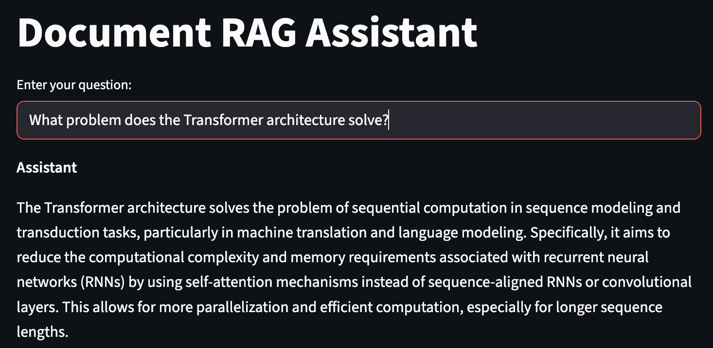
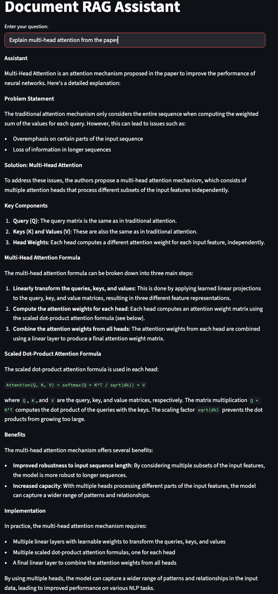

# Document RAG Assistant

I have built a simple **document-based `retrieval-augmented generation (RAG)` assistant** using **Ollama**, **LangChain**, and **Streamlit**. 

## Overview
This project is built with:

- **`Llama3.2`** as the language model for generating answers  
- **`nomic-embed-text embeddings`** to convert text chunks into vector representations  
- **`Multi Query Retriever`** to create multiple perspectives of the user question for better document retrieval  
- **`ChromaDB`** to store embeddings and cache data from PDFs for fast repeated queries  
- **`Streamlit`** interface for easy interaction with your document  

## Demo

## Demo Example

Here I am using the famous arXiv paper **`Attention Is All You Need`** as a Document. 
Here are some of the questions I asked my RAG Assistant. I have attached some demo examples too. 
- What is the title of this paper?
- What are the advantages of self-attention over RNNs?
- Give a high-level summary of the paper.
- What problem does the Transformer architecture solve?

- Explain multi-head attention from the paper.

## How it works

1. **Load a PDF**: We first read a PDF file from `./data/` using PyMuPDF.

2. **Chunk the document**: The text is split into overlapping chunks for more effective retrieval.

3. **Create/Load a Vector DB**: The embeddings are generated using Ollama’s `nomic-embed-text` model. It loads the existing DB if present (`./chroma_db`), otherwise it creates one from chunks. 

4. **Retriever**: Generates **5 alternative versions of a question** to improve search in the vector database.  

5. **Chain**: We combine retriever output with a **ChatOllama model** to produce a final answer to the user’s question. 

6. **Streamlit Interface**: It provides a demo app interface. Helps with inputting queries from users. Where a user just enters their question in a text box and gets a response generated in real time.  
